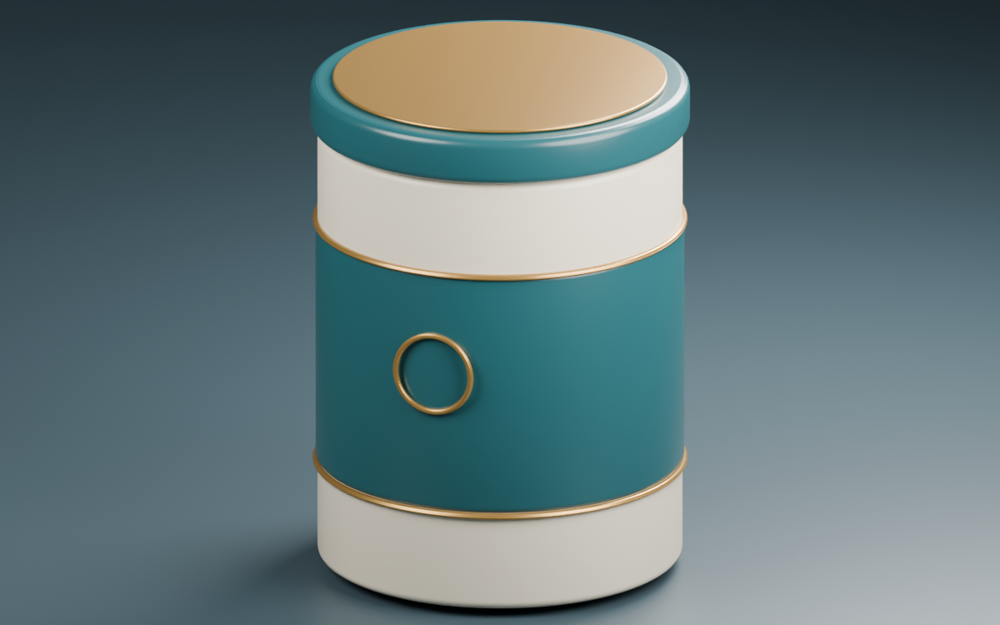

<div align="center">

# Blender Product Video

**从产品参考图，做到能继续修改的三维展示片。**

一个给 Codex 使用的制作技能，附带 Blender 示例与断点续渲染脚本。

[开始使用](#开始使用) · [查看流程](#怎么做) · [运行示例](#先跑一个无品牌示例) · [制作边界](#先说清楚边界)

</div>



<p align="center"><sub>无品牌示例 · 程序化几何与材质 · Blender 实际渲染</sub></p>

---

## 为什么做这个

做产品视频时，第一张图往往不难。难的是客户说“背景换一下，标签别动”，或者镜头绕到背面，前面没发现的接缝突然露出来。

这个技能从一次完整的包装产品制作中整理而来：四张效果图，建模、补标签、看样片、加旁白，最后输出一条10秒的高清展示片。

留下来的，是一套能继续改的工程和几个值得重复使用的做法：**先看样板，按重叠内容拼图，先确认运镜，再花时间渲染。**

## 能交付什么

| 成果 | 用途 |
| --- | --- |
| 可编辑 `.blend` 工程 | 改背景、相机、材质，继续出图 |
| 多角度产品图 | 检查外形，也可用于商品展示 |
| 运镜预览与高清视频 | 先确认节奏，再输出目标分辨率 |
| 可选旁白 | 按确认的文案和声音合成，不默认附带配乐 |

适合瓶、罐、盒、桶等包装外观。复杂角色、流体模拟、工程尺寸复刻不在这套流程的主要范围内。

## 开始使用

需要 **Codex**、**Blender**。输出视频时还需要 **FFmpeg**；只有需要配音时才需要文字转语音工具。

已在 Windows、Blender **4.5.13 LTS** 上验证。其他系统与版本尚未完整测试。

把仓库放进个人技能目录。下面使用默认的 `~/.codex/skills`；如果设置了 `CODEX_HOME`，请改用它下面的 `skills` 目录。

**Windows / PowerShell**

```powershell
git clone https://github.com/lzlin3459-hash/blender-product-video.git "$env:USERPROFILE/.codex/skills/blender-product-video"
```

**macOS / Linux**

```bash
git clone https://github.com/lzlin3459-hash/blender-product-video.git ~/.codex/skills/blender-product-video
```

已有同名技能时，先保留本地修改，不要直接覆盖。当前对话没有识别到新技能时，可在新对话中使用，或明确提供 `SKILL.md` 的路径。

然后把产品资料交给 Codex：

```text
使用 $blender-product-video。

这里是产品的正面、侧面和背面图，没有平面展开稿。
我要一条10秒的电商展示视频，方形画幅，带中文旁白。
品牌和标签内容不要改。先做外观样板，确认后再制作动画。
```

也可以只做其中一段：

```text
使用 $blender-product-video，继续修改这个已通过的工程。
只把背景改成浅灰色，相机、产品和标签保持原样。
```

## 怎么做

| 阶段 | 先看什么 | 再做什么 |
| --- | --- | --- |
| 01 · 输入 | 图片是否同一款产品，尺寸是否有依据 | 列出已知信息和需要估算的部分 |
| 02 · 外观 | 比例、盖子、提手、标签位置 | 保存可编辑模型和一张样板 |
| 03 · 环绕标签 | 重叠图案、文字顺序、拼接边界 | 补齐实际需要展示的方向 |
| 04 · 运镜与声音 | 构图、速度、近景、旁白长度 | 做低清预览，处理修改意见 |
| 05 · 高清交付 | 目标规格的单帧耗时 | 原生渲染、编码、验证并交付 |

不是每次都要从头走一遍。已有模型就接着用，已确认的旁白不再重做，只改镜头也不重建产品。

### 没有平面展开稿，也能开始

多张效果图可以提供标签线索，但它们未必是真正的不同相机角度。有些图片只是在同一个桶体模板上平移标签，直接当作四个90度视角会拼错。

技能会先判断重叠关系，再选择投影方式。详细方法见 [标签重建说明](references/label-reconstruction.md)。这部分由代理结合具体素材处理，仓库没有声称提供全自动多图重建算法。

## 先跑一个无品牌示例

不需要API密钥或下载模型素材。示例脚本生成包装容器、程序化材质、灯光和一个轻微转台动画，并输出一张图片。

在仓库目录运行（`blender` 需在 PATH 中，也可替换为完整程序路径）：

```bash
blender --background --python examples/create_demo.py -- --output output/demo
```

得到 `output/demo/demo.blend` 和 `output/demo/demo.png`。README 上方的图片就来自这个脚本。

要试一下帧序列，先渲染两帧：

```bash
blender --background --python-exit-code 1 --python scripts/render_frames.py -- --scene output/demo/demo.blend --output output/frames-test --width 320 --height 320 --samples 8 --start 1 --end 2
```

再次运行相同命令，会跳过已完成帧。修改工程或参数后，请换一个输出目录。

> `render_frames.py` 只负责渲染已有 Cycles 场景，不负责建模、编排镜头或配音。它比较工程哈希与渲染参数，先写临时PNG，完成后再重命名。带外部模拟缓存的工程需要单独处理。

## 先说清楚边界

- **原图模糊的小字，不会因为输出1080p就自动清晰。** 二维码能否扫描需要另行验证。
- **尺寸估算用于外观展示。** 不把效果图重建当成可生产的工程模型。
- **原图光影会带进标签。** 可以改善衔接，但不能保证还原未知的印刷颜色。
- **高清渲染需要时间。** 先测一帧，再估算整段；不承诺固定成本或“几分钟出片”。
- **配音工具需要单独配置。** 仓库不包含密钥，不捆绑某个声音，也不替第三方服务承诺商用许可。

## 仓库里有什么

```text
SKILL.md                         代理执行入口
agents/openai.yaml               技能显示信息
references/
  label-reconstruction.md        多图标签重建
  motion-and-delivery.md         动画、旁白、编码与验收
  verified-case.md               项目经验与示例说明
scripts/render_frames.py         可恢复的帧序列渲染
examples/create_demo.py          无品牌示例场景
docs/demo.png                    示例效果图
```

## 反馈与改进

欢迎提交实际遇到的问题。请附 Blender 版本、执行命令、预期结果和报错；图片或工程只上传你有权公开的部分。遇到标签错位，提供重叠区域通常比只描述“看起来不对”更有帮助。

## 许可证

[GPL-3.0](LICENSE)。本仓库与 Blender、OpenAI 无隶属关系。示例不包含客户品牌素材；你用于制作的产品图片、商标、音乐和第三方声音，仍按各自的授权使用。
